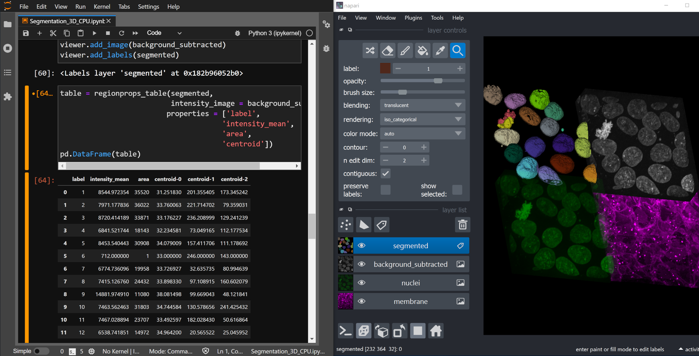
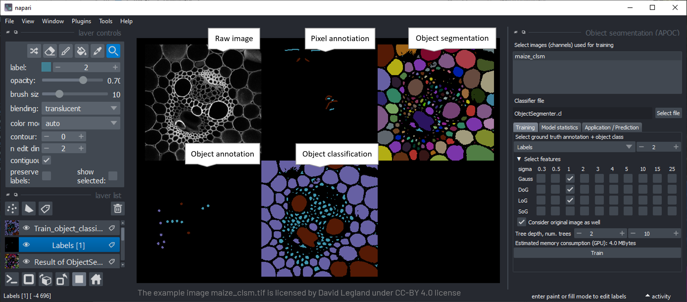
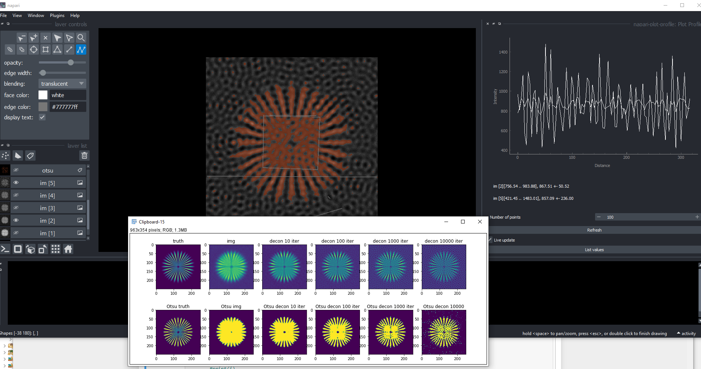
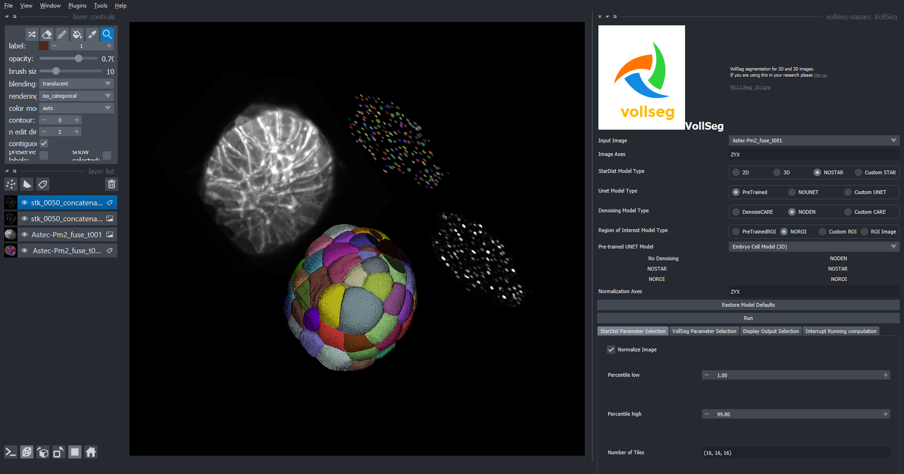
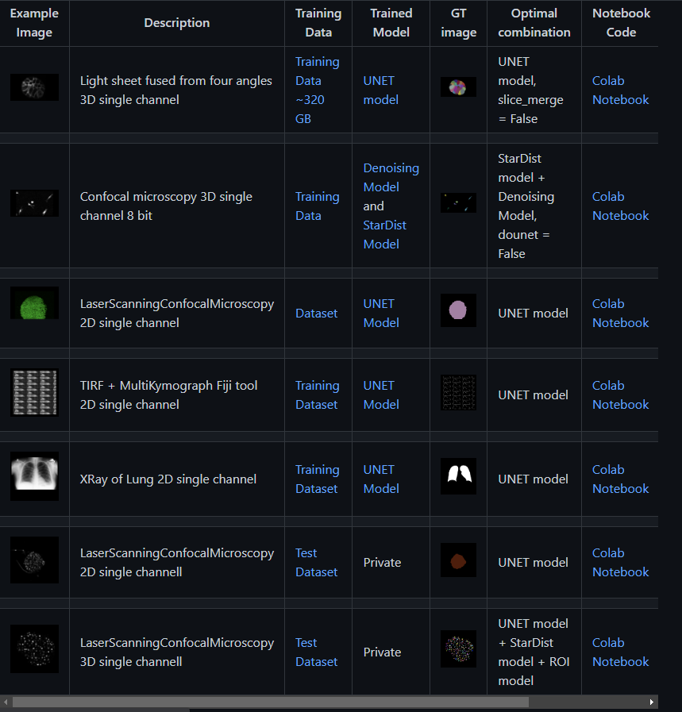
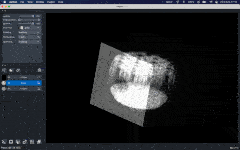

# I2K2022 napari workshop

This is a joint effort by the [napari](https://napari.org) community. Napari is a tool gaining more and more attention in the bio-image analysis community. Beyond giving a general introduction to napari and its plugin ecosystem, we would like to demonstrate its current capabilities and some plugins we are working on and with.

## Provisional program
* Introduction to napari (15 min, Lorenzo Gaifas)
* Using napari from Jupyter notebooks (15 min, Marcelo Zoccoler)
      
    * [Prepare data](notebooks_and_napari/save_image_locally.ipynb)
    * [My Segmentation Workflow](notebooks_and_napari/my_segmentation_workflow.ipynb)
    * [Batch Segmentation Workflow](notebooks_and_napari/batch_segmentation_workflow.ipynb)
* [Accelerated pixel and object classification](https://www.napari-hub.org/plugins/napari-accelerated-pixel-and-object-classification) (15 min, Robert Haase)
    
    * Interactive classifier training in napari
    * [Application in python](apoc/apoc_demo.ipynb)
* Labeling with overlapping labels (~30 minutes, Tom Burke + Joran Deschamps(maybe))
    * Plugin presentation for overlapping labels and labelset creation
    * I/O in a transferable format compatible with ImgLib2/Fiji
    * Outlook to use-cases and possible workflows
* Restoration and Measurement (20 minutes, Brian Northan)  
       
    * Atendees should be comfortable programming short Python code segments in IPython Notebook
    * Briefly introduce Deconvolution and Background Subtraction
    * Talk about important of Point Spread Function, how to compute it. 
    * Deconvolve and/or apply background subtration to real images.
    * Perform segmentation, watershed and then morphological and intensity measurements
    * Show how Restoration can improve downstream measurements.   Show how to explore input images and processed images using Napari and Matplotlib.
* Different use cases for segmentation in VollSeg Napari plugin (20 min, Varun Kapoor)
       
       
    * Demo links: [Video1](https://youtu.be/W_gKrLWKNpQ)  [Video2](https://youtu.be/7tQMn_u8_7s)
    * A short intro to VollSeg Napari plugin and presnet use case for Light sheet imaged fused Ascadian embryo.
    * Present a second use case on TZYX dataset of breast carcinoma cells.
    *  Show the UX features like cancelling jobs running in background threads, displaying results of interest and other options to choose from.
    *  Presnet a third use case of sparse but concentrated 3D nuclei with large background pixels.
    *  Show the availability of training, test datasets and trained models with colab notebooks and accuracy metric evaluation for the presented use cases and more:  [here](https://github.com/Kapoorlabs-CAPED/CAPED-AI-vollseg-napari).
    

* 3D interactivity in napari (15 mins, Alister Burt, Kevin Yamauchi)
         
    * (5 mins) introduction and motivation behind 3D interactivity, show 3D interactivity docs
        * Large 3D datasets (fluorescence, EM), multiple existing solutions for vis
        * Annotation in 3D is non-trivial but essential for analysis (e.g. deep learning)
        * Also, exploring 3D data along axis not aligned with the data axes is difficult
        * implementing custom modes of interacting with data in 3D currently requires development of an entire application
    * (10 mins) introduce napari-threedee, demo and wrap up
        * Use case 1: using built-in widget plugins to interact with your data
        * Use case 2: using the manipulators/annotators in your own application
* How to make Napari plugins + testing (Draga Doncila Pop)
  * [Pre-recorded tutorial](https://www.youtube.com/watch?v=NL-VywidzXE)

## Installation instructions

We would like to ask attendees of the workshop to setup conda on their computers before the session. If you have never used conda before, please [read this guide first](https://biapol.github.io/blog/johannes_mueller/anaconda_getting_started/).

Afterwards, please create a couple of environments

### Basic napari + jupyter lab

    conda create --name basic-napari python=3.9
    conda activate basic-napari
    conda install -c conda-forge napari jupyterlab

### developmental biology napari

[See also](https://github.com/haesleinhuepf/devbio-napari#installation)

    conda create --name devbio-napari python=3.9
    conda activate devbio-napari
    conda install -c conda-forge pyopencl==2021.2.6 hdbscan numba=0.55.1
    pip install devbio-napari

Mac-users please also install this:

    conda install -c conda-forge ocl_icd_wrapper_apple

Linux users please also install this:

    conda install -c conda-forge ocl-icd-system
    
### deconvolution napari

Deconvolution napari is an extension of developmental biology napari but requires the jupyter notebook extension and a couple of experimental libraries.

We could just add these to devbio-napari but it's good practice to install experimental libraries in a new environment. 

    conda create --name decon-napari python=3.9
    conda activate decon-napari
    conda install -c conda-forge jupyterlab
    conda install -c conda-forge pyopencl==2021.2.6 hdbscan numba=0.55.1
    pip install devbio-napari
    conda install -c conda-forge fftw
    pip install napari-sdeconv
    pip install git+https://github.com/True-North-Intelligent-Algorithms/tnia-python
    pip install --index-url https://test.pypi.org/simple/ --no-deps clij2-fft
    pip install stardist

Mac-users please also install this:

    conda install -c conda-forge ocl_icd_wrapper_apple

Linux users please also install this:

    conda install -c conda-forge ocl-icd-system

### Deep learning napari ?

## License

The materials in this repository are licensed [CC-BY 4.0](https://github.com/haesleinhuepf/I2K2022-napari-workshop/blob/main/LICENSE-CC-BY) by the [contributors](https://github.com/haesleinhuepf/I2K2022-napari-workshop/graphs/contributors) unless mentioned otherwise.
